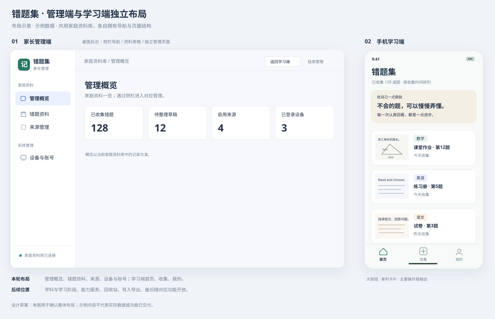

# 学习端与管理端独立界面设计

状态：整体风格基准已确认。用户于 2026-09-22 确认“界面整体风格先按现在的来”，后续界面沿用当前 Demo 的风格及已明确的入口精简方案。正式应用正在按 #29—#32 逐项改造，进度见[任务索引](ui-separation-tickets.md)。

关联：[本次界面设计 #28](https://github.com/xianpingduan/klbook/issues/28)、收集版规格 #1、当前局域网采集 #4、来源管理 #27、后续移动交付 #26。

## 已明确的方向

- 管理端使用后台管理系统的界面布局。
- 手机上的学习端使用适合触控、逐步收集和查看题目的界面布局。
- 两端各自设计导航、页面外框、信息密度和操作位置。
- 延续同一家庭资料库、原始页保留和已确认的收集流程。
- 家长后台同时负责协助整理错题与管理系统。
- 手机、平板和电脑都可进入学习端；管理通过独立入口进入。
- 学习端采用清爽学习工具风格：浅色、大按钮、少装饰。
- 学习端保留底部三个 Tab：首页、收集、我的。根据用户要求最大化精简：已收集题目直接在首页查看，新材料和草稿统一在收集页处理，我的页集中资料库连接与家长管理。
- 同一功能保留固定入口；必要的返回、取消、保存及批次继续操作随当前流程展示。详情与收集步骤收起全局 Tab。
- 家长进入后台先看到管理概览，再进入各项管理。

本次使用“学习端”和“管理端”区分使用界面；“后端服务”指处理请求与保存资料的服务。已记入领域词汇表。

## 当前风格基准

- **学习端**：浅色背景、柔和绿色主色、圆角卡片、大按钮与足够留白；底部三个 Tab，各功能集中到固定位置。
- **首页鼓励语**：标题下的浅暖色展示区域，短句、温和、关注理解与进步；不作为新的操作入口。
- **管理端**：白色与浅灰蓝背景、蓝色主要操作、独立侧栏、紧凑清晰的表格与表单；管理概览以数量呈现。
- **延续方式**：后续页面复用以上颜色、排版、间距、导航与控件风格；根据实际内容和设备调整细节。

本次确认建立视觉与布局基准；正式功能实现及其权限、同步、异常处理验收仍按对应规格推进。

## 现状与问题

当前 `App.tsx` 的 `Frame` 为登录、日常收集及 `ParentPanel` 提供同一个外框；`parentOpen` 控制在主页面内切换管理面板。`style.css` 中 `header`、`button`、`input`、`.card` 等全局规则同时作用于两类界面。

因此电脑管理缺少稳定的导航、工具栏和资料表格空间，手机收集也承受了电脑页面的标题、说明和信息布局。本次需要重设两类页面的结构与操作流程。

## 首轮设计决定

| 编号 | 决定 | 推荐方向 | 状态 |
| --- | --- | --- | --- |
| Q1 | 家长后台是否协助整理错题 | 查看、更正资料及管理系统；孩子仍是日常收集主体 | 已确认 |
| Q2 | 平板和电脑是否可进入学习端 | 各设备均可学习；管理通过独立入口进入 | 已确认 |
| Q3 | 手机端视觉方向 | 清爽学习工具：浅色、大按钮、少装饰 | 已确认 |
| Q4 | 学习端首屏与导航 | 用户调整为首页 + 固定底部 Tab，首页内容见下文 | 已确认 |
| Q5 | 管理端首屏 | 用户选择管理概览，再进入各项管理 | 已确认 |
| Q6 | 底部 Tab 数量 | 首页 / 收集 / 我的；后续按用户精简要求将错题列表直接放在首页 | 已确认 |

整体风格已结合可点击 Demo 确认；菜单、页面与入口方案见下文。已确认的权限与收集规则沿用，不重复询问。

## 布局示意

示意使用虚构材料，展示管理概览与采用三个底部 Tab 的手机首页。图片中的样例数量和资料不来自实际家庭资料库。

## 可点击 Demo

按用户要求先提供页面预览。Demo 保存在独立设计分支 `codex/ui-separation-demo`，目录为 `src/client/prototypes/ui-separation/`，运行方式见该目录的 `README.md`。

- 学习端可切换手机、平板和电脑宽度，体验三个 Tab、示例选图、拖动框题、学科与来源填写、保存、批次取消/继续、草稿及详情。
- 管理端独立使用侧栏、概览卡片、资料表格和更正表单，演示来源新增/改名/停用及设备操作。
- 两端在同一个演示页面内共享示例记录；刷新或另开页面会重置。相机、相册、连接和身份验证均为演示，不连接真实资料或调用正式服务。
- 已在桌面浏览器检查主要交互、批次材料保留、来源停用后选择规则、端间资料更正，以及手机/平板/电脑宽度；未将这些检查视作正式功能或真机验收。

正式实施依据已整理为[独立布局规格](spec-ui-separation.md)，并发布到 #28；用户已确认[四项开发任务](ui-separation-tickets.md)，已发布为 #29—#32 并核验父子关联及前置依赖。从 [#29 独立入口、真实登录与管理概览](https://github.com/xianpingduan/klbook/issues/29) 开始，后三项均仅依赖 #29。[#29 实施记录](verification/issue-29.md)单独记录真实功能与验证结果。

## 管理端布局草案

- **左侧固定导航**：按管理目的分组，当前位置清晰；宽屏持续可见。
- **顶部栏**：页面标题、家庭资料库身份、返回学习端、结束管理。
- **主内容区**：页面说明简短，筛选及主要操作靠近表格；列表字段对齐，操作位置固定。
- **管理概览**：进入后台的首屏，只展示已收集题数、待整理草稿数、启用来源数、已登录设备数；不再重复侧栏入口、草稿操作和上传按钮。统计基于家庭资料库已有记录，本设备待上传材料另外提示。服务运行、备份状态随相应功能加入。
- **资料详情与更正**：在独立详情页使用左侧题目和原始页、右侧归档表单，保存结果清楚。
- **来源管理**：名称、启用状态及操作组成表格；新增、改名、停用、重新启用复用已有能力。
- **设备与账号**：设备列表与撤销操作、恢复码管理分区呈现，继续要求家长验证。
- **窄屏访问后台**：侧栏收为抽屉，表格按字段重要性调整展示；后台身份和管理权限保持明确。

初次改版优先承载已有功能。学科管理、服务配置、回收站、导入导出与备份的菜单位置写入后续规划，随对应功能交付后开放。

## 学习端布局草案

- **手机竖屏单列**：短标题、必要的连接/暂存提示、大图和明确的主操作。
- **首页**：标题下展示简洁的鼓励语区域，再展示已收集题目列表，点题目进入详情。鼓励语采用温和、关注思考与进步的文案，如“不会的题，可以慢慢弄懂。”，配一句简短说明；是纯展示区域，不增加按钮、跳转或收集入口。移除头像、草稿横幅、“最近收集/查看全部”和额外错题本页面。
- **收集入口**：通过底部“收集”Tab 进入，再选择拍照或相册；首页不重复放置拍照/相册按钮，空状态以文字指向底部导航。电脑学习端提供图片上传。
- **题目列表**：首页展示可读的题目预览、学科、来源和收集时间；草稿仅在收集页展示，点开继续整理，无第二个草稿列表入口。正式应用题量增加后在原列表内分页或继续加载。
- **收集过程**：选材料 → 框住题目 → 确认学科并保存。来源、题号、页码、备注作为补充内容，不增加必填项。
- **批量材料**：显示当前张数、剩余张数和单张取消；保存后提供继续下一张。
- **框题页面**：尽量保留图片空间，主要操作靠近屏幕下方；与页面滚动、键盘和底部安全区域配合。
- **保存与失败**：区分“已收集”“已同步”“待上传”；服务不可达时保留材料并提供重试。
- **我的**：直接显示当前资料库和连接状态，保留家长管理、退出当前设备；去掉错题本、草稿、独立连接详情与帮助入口，操作提示放回收集流程。

复习、习惯统计、学习激励和 AI 解题仍属于后续学习阶段，本次不放入可操作的首版导航。

## 页面与导航

### 管理端

| 页面 | 页面结构 | 本次承载内容 |
| --- | --- | --- |
| 管理概览 | 四项真实计数 | 已收集、草稿、启用来源、已登录设备；业务页面统一从侧栏进入 |
| 错题资料 | 工具栏 + 已收集/草稿切换 + 表格 | 每条资料仅保留“打开”，进入同一查看与更正页面；上传材料仅在本页提供 |
| 资料详情 | 面包屑 + 左图右表单 + 保存操作区 | 查看题目/原始页，更正已有字段；后续多页及解答区随对应任务加入 |
| 来源管理 | 表格 + 新增/编辑表单 | 新增、改名、停用、启用；旧题归属规则沿用 |
| 设备与账号 | 设备列表 + 独立恢复码区域 | 查看设备、撤销、结束管理、恢复码管理 |

后续菜单规划：

- 家庭资料：学科与学习阶段、回收站。
- 能力服务：图片识别、语音转写、AI 学习，用量与额度。
- 数据管理：资料包导入/导出、完整备份与恢复。
- 系统管理：服务状态、设备与账号。

这些功能沿用原任务 #8、#13—#24 的交付范围。未完成的能力不作为本次界面改造中的可用操作；不在管理首页放置虚构的学习或服务统计。

### 学习端

| 页面 | 手机结构 | 平板/电脑学习结构 |
| --- | --- | --- |
| 首页 | 鼓励语区域、已收集题目列表；点题目进入详情 | 相同内容，题目卡片可分列；保持学习端导航 |
| 收集 | 拍照/相册、全部待整理草稿；进入流程后显示批量进度与取消 | 电脑优先图片上传；平板保留拍照与相册 |
| 框题与确认 | 大图框选与确认信息分步展示，底部主要操作 | 左侧大图、右侧确认信息，必要时仍可分步 |
| 错题详情 | 题目优先，原始页、备注和归档信息展开查看 | 题目与补充信息并列 |
| 我的 | 家长管理入口、当前资料库/连接信息、设备退出 | 相同职责；客户端地址设置随 #11/#12 交付 |

底部导航采用“首页 / 收集 / 我的”三个 Tab，只在这三个主页面出现；详情、框题和保存步骤使用当前流程的返回及主要操作。保存完成后有剩余材料则继续下一张或暂存剩余材料，无剩余材料则完成并回到首页。

### 重复入口精简记录

| 原重复入口 | 精简后唯一归属 |
| --- | --- |
| 首页头像与“我的”Tab | 底部“我的” |
| 首页“查看全部”、独立错题本、“我的错题本” | 首页直接显示已收集列表 |
| 首页草稿横幅、收集页预览/全部草稿、我的草稿、错题本草稿切换 | 收集页的待整理草稿列表 |
| 我的帮助入口与收集步骤提示 | 提示直接放在对应步骤 |
| 我的连接行再打开只读详情 | 我的页直接显示连接信息 |
| 管理概览快捷卡片、草稿处理入口与侧栏页面 | 统一从管理侧栏进入，概览只显示统计 |
| 概览与错题资料页的上传按钮 | 管理端错题资料页 |
| 资料表格的查看/更正双入口及详情页再次更正 | 一次“打开”，在同一页查看和修改 |

Demo 顶部的两端切换、尺寸与重置属于标明的预览工具；正式页面不包含这条工具栏。角色各自需要的收集、整理能力，以及返回和防止未保存内容丢失的提示继续保留。

## 入口、切换与权限

- 推荐在当前同一站点下使用 `/learn` 和 `/admin` 两个入口，分别进入学习首页和管理概览；根入口进入学习端，家长可收藏后台地址。URL 是实施建议，页面入口按学习与管理用途区分。
- 学习端“我的 → 家长管理”进入独立验证页；后台右上角提供“返回学习端”和“结束管理”。继续沿用当前家长验证与 5 分钟管理授权。
- 进入或退出后台时，未保存字段先提示处理；仅选择留在当前页面时保持编辑状态。已有本机待上传图片和稳定操作标识继续保留，不因切换界面重建。
- 返回学习端时重新读取来源等可变配置；正在编辑的旧题若使用已停用来源，继续遵守现有保留规则。
- 授权到期后管理操作锁定，保留允许保留的非敏感表单内容，重新验证后再继续；敏感凭据不作为普通草稿保存。
- 管理端入口要求家长验证；来源、设备和后续服务/数据管理继续由后端校验权限。学习端已有题目收集、更正权限保持原约定。
- 首次家庭设置、账号恢复和登录分别有清楚的目的地，完成后回到所需入口；未验证不得直接进入后台内容。

## 实施约束与验收边界

- 布局与样式分别限定在管理端和学习端作用范围，避免继续使用一组全局 `.card`、`header`、`button` 规则控制所有页面。
- 共用领域模型、API、图片显示/框选和设备暂存能力，不复制成两套资料或收集规则。
- 保持现有协议、主机和端口对应的网页来源；仅改变路径，避免丢失现有浏览器凭据及待上传图片的访问。
- 独立路径必须支持直接打开和刷新；页面路径的回退不能覆盖 `/api/v1` 的 API 响应和错误。
- 手机主要触控区域建议至少 48 CSS 像素；底部操作不遮挡内容，键盘打开时确认按钮仍可达；不依赖悬停操作。
- 学习端不要求输入家长账号、设备名或资料库标识来完成每天收集；这些信息集中在登录/设置或“我的”。
- 改版承载现有收集、来源和设备管理能力；搜索筛选、多页/共享阅读、识别和备份仍由原议题落实。本次不扩展成新的业务模块。
- 本次图稿使用示例资料，未读取家庭真实题目；正式改造需要重新验证路由刷新、端间切换、权限锁定及现有收集回归。

## 两端共用与独立的边界

| 内容 | 处理方向 |
| --- | --- |
| 家庭资料库、题目、来源、原始图片 | 共用同一份资料 |
| 收集状态、稳定操作标识、图片校正与框选规则 | 复用现有行为 |
| 页面外框、导航、列表呈现、表单排列、操作区 | 按管理与学习目的分别设计 |
| 家长管理权限 | 继续通过服务端校验，访问管理页面不等于获得授权 |
| 管理授权到期 | 继续采用现有规则，设计保留未提交内容并提示重新验证 |
| 网页与未来 APK/iOS App | 学习端可继续共享 React 页面与平台适配 |

ADR 0004 选择共享 React 页面及 Capacitor 移动交付，并未要求家长后台与学习者页面使用同一布局。界面拆分本身不要求改变该移动交付决定。

## 设计评审要检查的场景

1. 孩子用手机进入后能直接看到收集与已有题目，管理表格不会混入日常收集页面。
2. 家长用电脑管理来源及设备，能通过稳定导航进入对应页面。
3. 学习端与管理端切换前，未提交编辑和本机待上传材料不会丢失。
4. 管理授权到期或主动结束后，后台操作正确锁定；日常收集会话行为符合已有约定。
5. 拍照、相册多选、取消、刷新恢复、停服后重试和另一设备找回等已验证行为得到保留。
6. 同一题在两个界面呈现一致资料；未实现的后台能力不显示为已可用。

## 当前不作的决定

当前不把布局拆分推定为分库、独立部署、增加多家庭账号或重新选择技术栈。这些都不是本次用户提出的界面问题。

后续正式页面改造以本次风格基准和独立布局规格为依据，按确认后的开发任务推进。
